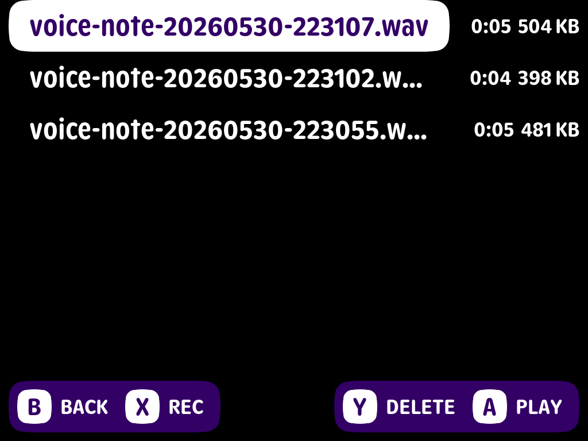

# Voice Notes for NextUI

Voice Notes is a NextUI pak for recording and playing short voice notes with
the TrimUI Brick microphone.



Recordings are saved as WAV files in:

```text
/mnt/SDCARD/Recordings
```

## Install

1. Download the latest `NextUI-Voice-Notes-*-tg5040.zip` from
   [Releases](https://github.com/icoreee/nextui-voice-notes-pak/releases/latest).
2. Extract the zip to the root of your SD card.
3. Safely eject the SD card.
4. Open NextUI -> Tools -> Voice Notes.

The zip contains:

```text
Tools/tg5040/Voice Notes.pak/
```

## Controls

```text
Up / Down: select recording
X: start recording
A while recording: finish recording
B while recording: cancel recording

A: play selected recording
A while playing: pause / resume
Y while playing: stop
Left / Right while playing: seek -5 / +5 seconds

Y: delete selected recording
A during delete confirm: confirm delete
B during delete confirm: cancel delete

B: back / exit
```

## Build

Build with the tg5040 toolchain:

```sh
make release
```

The release zip is written to:

```text
dist/NextUI-Voice-Notes-v0.1.0-tg5040.zip
```

The SD-card-ready pak folder is written to:

```text
build/Tools/tg5040/Voice Notes.pak/
```

## Runtime Settings

Defaults:

```text
VOICE_NOTES_OUTPUT_DIR=/mnt/SDCARD/Recordings
VOICE_NOTES_DEVICE=hw:0,0
VOICE_NOTES_RATE=48000
VOICE_NOTES_CHANNELS=1
VOICE_NOTES_FORMAT=S16_LE
```

The default recording format is mono 16-bit PCM WAV at 48 kHz.

## Known Limits

- Seek is implemented for PCM WAV files recorded by this pak.
- Microphone quality depends on the device hardware and mixer settings.
- This pak currently targets `tg5040`.

## Credits

Built with [Apostrophe](https://github.com/Helaas/apostrophe), vendored under
`third_party/apostrophe`. Apostrophe is licensed separately; see
`third_party/apostrophe/LICENSE`.
